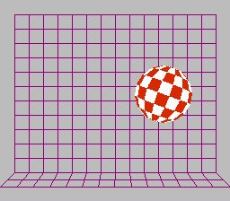

# NES ball demo

This is a port of the classic Amiga bouncing ball demo to the Nintendo Entertainment System (NES).

## Try it

The most recent version is available in the [releases](https://github.com/mike42/nes-ball-demo/releases) section. It is shipped as an iNES ROM (`.nes`), which is suitable for use in a NES emulator or flash cartridge.

## Build it

The steps to build this project are listed in `build.sh`. You will need `python3` and the `cc65` toolchain installed.

## License

The code may be used, distributed and modified under the terms of the MIT license, see [LICENSE](https://github.com/mike42/nes-ball-demo/blob/master/LICENSE) for details.

The code is based on a NES example project by Brad Smith, which can be found at [bbbradsmith/NES-ca65-example](https://github.com/bbbradsmith/NES-ca65-example).
